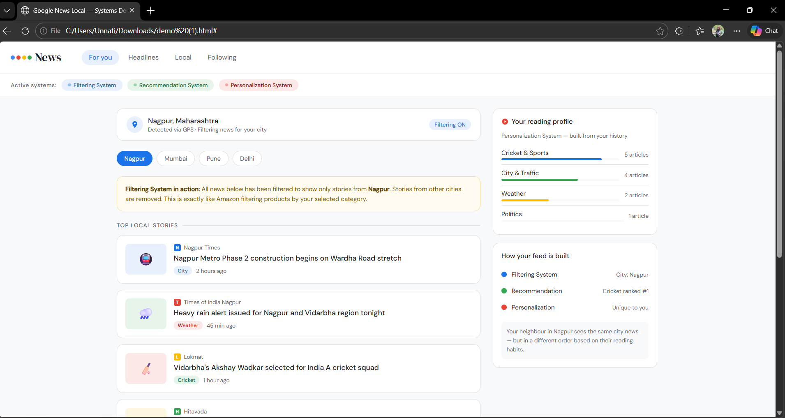

#  Case Study — Google News: Systems & Operations Behind Local News

<div align="center">


</div>

---

##  Table of Contents

- [Assignment Context](#-assignment-context)
- [Overview](#-overview)
- [Core Systems Used](#-core-systems-used)
- [How It All Works — Technical Pipeline](#-how-it-all-works--technical-pipeline)
- [System 1 — Filtering](#-system-1--filtering)
- [System 2 — Recommendation](#-system-2--recommendation)
- [System 3 — Personalization](#-system-3--personalization)
- [Operations in Detail](#-operations-in-detail)
- [Ranking Factors](#-ranking-factors)
- [Challenges](#-challenges)
- [Real-World Examples](#-real-world-examples)
- [Key Findings](#-key-findings)
- [Conclusion](#-conclusion)
- [References](#-references)

---

##  Assignment Context

> This case study was created as part of a  IT assignment.
> The assignment required students to select any website and study **what kind of systems and operations it uses internally** — how it works behind the scenes.
> - My chosen website → **Google News** (Filtering + Recommendation + Personalization)
>**Google News uses filtering, recommendation, and personalization systems to improve how local news is delivered to each user.**

---

##  Overview

| Field | Details |
|---|---|
| **Website Chosen** | Google News (news.google.com) |
| **Feature Studied** | Local News Section |
| **Core Systems Identified** | Filtering System, Recommendation System, Personalization System |
| **Study Period** | 2002 – 2026 |

Google News is the world's largest automated news aggregator. Its **Local News** feature is the perfect example of how a modern website uses multiple systems together — it knows where you are, learns what you like, and keeps getting smarter every time you use it.

---

##  Core Systems Used

| System | What It Does | Real-World Parallel |
|---|---|---|
| **Filtering System** | Shows only news from YOUR city/location | Like Amazon filtering products by category |
| **Recommendation System** | Suggests news based on your reading habits | Like Amazon's "You may also like" feature |
| **Personalization System** | Makes your feed unique to you specifically | Like Spotify's personalised playlists |

> These three systems work together at the same time — every time you open Google News.

---

##  How It All Works — Technical Pipeline

```
┌─────────────────────────────────────────────────────────┐
│  STEP 1: GEOLOCATION (Filtering begins here)            │
│  IP Address → GPS → Google Maps → User-set location     │
└────────────────────────┬────────────────────────────────┘
                         ↓
┌─────────────────────────────────────────────────────────┐
│  STEP 2: WEB CRAWLING                                   │
│  Googlebot reads all local news websites automatically  │
└────────────────────────┬────────────────────────────────┘
                         ↓
┌─────────────────────────────────────────────────────────┐
│  STEP 3: GEOGRAPHIC CLASSIFICATION (Filtering)          │
│  Is this article about YOUR city? Yes → Local pile      │
└────────────────────────┬────────────────────────────────┘
                         ↓
┌─────────────────────────────────────────────────────────┐
│  STEP 4: RANKING ALGORITHM                              │
│  7 factors scored: Freshness, Location, Trust,          │
│  Relevance, Prominence, Usability, User Interest        │
└────────────────────────┬────────────────────────────────┘
                         ↓
┌─────────────────────────────────────────────────────────┐
│  STEP 5: RECOMMENDATION + PERSONALIZATION               │
│  Your reading history shapes what you see first         │
│  → Delivered via App / Web / Discover / Assistant       │
└─────────────────────────────────────────────────────────┘
```

---

##  System 1 — Filtering

**What it is:** A filtering system removes irrelevant content and shows only what matches your location.

**How Google News uses it:**
- Detects your city using GPS, IP address, and Google Maps saved addresses
- Crawls thousands of local news websites using Googlebot
- Classifies each article — is it about YOUR city or not?
- Articles NOT about your location are filtered OUT of your local section

**Analogy:** Just like an e-commerce website filters products by category, price, or brand — Google News filters all news by your geographic location.

---

## System 2 — Recommendation

**What it is:** A recommendation system studies your past behaviour and suggests content you are likely to want.

**How Google News uses it:**
- Tracks which articles you click and read
- Tracks which topics you skip or ignore
- Builds a silent "reading profile" for you
- Uses that profile to push similar local stories higher in your feed

**Analogy:** Exactly like Amazon saying "Customers who bought this also bought..." — Google News says "People who read this local story also read..."

---

##  System 3 — Personalization

**What it is:** Personalization combines filtering + recommendation to create a completely unique feed for each individual user.

**How Google News uses it:**
- Two people living in the same city get different feeds
- Your feed changes over time as your reading habits change
- The "For You" section is 100% personalised — no two users see the same thing
- Users can also manually follow specific topics, cities, or publishers

**Analogy:** Like how Spotify creates a "Discover Weekly" playlist unique to each person — Google News creates a local news feed unique to each reader.

---

##  Operations in Detail

### Automated Content Discovery (2025)
> As of March 2025, Google News **fully automated** how it finds and lists publishers.
- No manual submission needed from local newspapers
- Algorithm automatically discovers local news websites
- Publishers must focus on content quality to be included

### Google News Initiative — Supporting Local Publishers
| Program | Goal |
|---|---|
| Digital Growth Program | Help local publishers grow audience and ad revenue |
| Startups Program | Support new digital-only local news outlets |
| News Showcase | Google pays publishers for premium story panels |

### Quality Control
- Articles from fake or low-quality websites are filtered out
- E-E-A-T framework used: Experience, Expertise, Authoritativeness, Trustworthiness
- Fact-checked articles are labeled and highlighted

---

##  Ranking Factors

Every local article gets scored on 7 factors. Higher score = shown first.

```
RELEVANCE         ████████████  Matches user's location & interests
LOCATION          ████████████  How close the story is to your city
FRESHNESS         ████████████  Breaking news ranked higher
AUTHORITATIVENESS ████████████  Is the source trustworthy?
PROMINENCE        ████████████  How many sources cover this story
USABILITY         ████████████  Is the website fast and mobile-friendly?
USER INTEREST     ████████████  Based on your reading history
```

---

##  Challenges

| Challenge | Explanation |
|---|---|
| News Desert Problem | Some cities have no local publishers — nothing to show |
| Algorithm Opacity | Publishers don't know why they rank high or low |
| Misinformation | Fake local news sites are harder to detect |
| Paywall Tension | Users click a story but can't read it — bad experience |
| Revenue Gap | Small local publishers struggle to earn from Google traffic |

---

##  Real-World Examples

### Sahan Journal, Minnesota
- Nonprofit local news for immigrant communities
- Used Google's recommendation + audience tools
- Result: 800%+ increase in advertising revenue

### San José Spotlight, California
- Digital-first local news startup
- Grew to 1.6 million+ readers using Google News recommendation traffic

### Impacto Latino, New York
- Spanish-language local news
- 350% increase in active monthly users

---

## Key Findings

1. Google News uses **3 systems together** — Filtering, Recommendation, Personalization
2. The **Filtering System** is the foundation — without location, nothing works
3. The **Recommendation System** is the most powerful — it learns you silently over time
4. The **Personalization System** is the output — your unique daily news feed
5. This is very similar to how Amazon works — just for news instead of products
6. The system gets smarter the more you use it — just like any recommendation engine

---

## Conclusion

Google News's Local News section is a perfect real-world example of how modern websites combine multiple systems to deliver a better user experience.

- **Google News** uses: Geolocation Filtering + Recommendation System + Personalization
This case study shows that recommendation and personalization systems are not limited to e-commerce — they power almost every major website we use daily.

---

##  References

1. Google. (2025). *Understanding How News Works on Google.* https://google.com/intl/en_us/search/howsearchworks/how-news-works/
2. Google News Help. (2025). *How Google News stories are selected.*
3. Google News Help. (2025). *Get local news for cities you're interested in.* https://support.google.com/googlenews/answer/9256668
4. Google News Initiative. (2025). *Supporting Local News.* https://newsinitiative.withgoogle.com
5. Wikipedia. (2025). *Google News.* https://en.wikipedia.org/wiki/Google_News
6. State of Digital Publishing. (2025). *Google News SEO Guide.*
7. Search Engine Land. (2025). *Google News: Latest Analysis and Updates.*

---

<div align="center">
  ##  Demo Preview



##  About the Author

| Field | Details |
|---|---|
| **Name** | Unnati Vihirkar |
| **Class** | 2nd year |
| **College** | Yeshwantrao Chavan College of Engineering |
| **Course** | IT MDM  |
| **GitHub** | [@yourusername](https://github.com/yourusername) |

> This case study was created as part of a  IT assignment
> to explore what kind of systems and operations modern websites use internally.

**Case Study |  IT | Google News Local News Systems**


</div>
